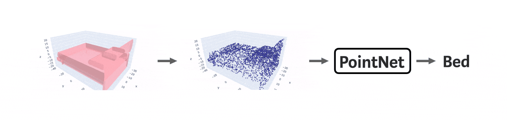
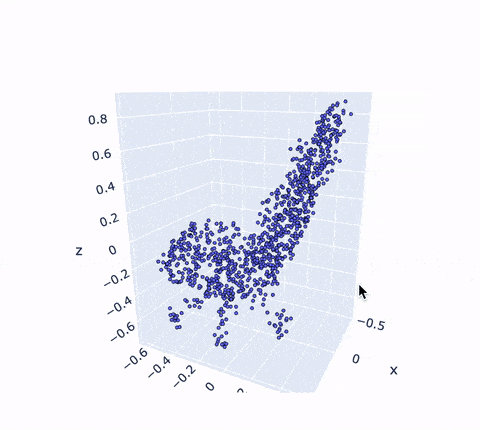
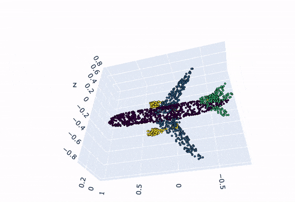

# PointNet
PyTorch implementation of "PointNet: Deep Learning on Point Sets for 3D Classification and Segmentation" https://arxiv.org/abs/1612.00593

 

## Classification dataset
This code implements object classification on [ModelNet10](https://modelnet.cs.princeton.edu) dataset.

As in the original paper, we sample 1024 points on objects surfaces depending on the area of the current face. Then we normalize the object to a unit sphere and add Gaussian noise. This is an example of input to the neural network that represents a chair:

 

You can download the dataset by following [this link](https://drive.google.com/open?id=12Mv19pQ84VO8Av50hUXTixSxd5NDjeEB)

## Classification performance

| Class (Accuracy) | Overall | Bathtub | Bed| Chair|Desk|Dresser|Monitor|Night stand|Sofa|Table|Toilet|
| :---: |:---: | :---: | :---: | :---: | :---: | :---: | :---: | :---: | :---: | :---: | :---: |
| ModelNet10 | 82.0% | 93.4% | 92.0% | 97.2% | 81.5% | 71.0% | 89.4% | 56.0% |86.9%| 93.4% |95.9%|

Pretrained model is available [here](https://drive.google.com/open?id=1nDG0maaqoTkRkVsOLtUAR9X3kn__LMSL)

## Usage
* The first and the best option is to run the notebook with comments and visualizations `/nbs/PointNetClass.ipynb` in Google Colab.
* The second option is to clone the repository on a local machine and run a model with default parameters:
  ```bash
  git clone https://github.com/nikitakaraevv/pointnet
  wget http://3dvision.princeton.edu/projects/2014/3DShapeNets/ModelNet10.zip
  unzip -q ModelNet10.zip
  cd pointnet/
  python train.py 
  ```
  If for some reason it doesn't work, you can install the requirements before running `python train.py`:
  ```bash
  conda create -n env python=3.7
  conda activate env
  pip install -r requirements.txt
  ```
  Another example of running a model is:

  ```python train.py  --root_dir ../ModelNet10/ --batch_size 16 --lr 0.0001 --epochs 30 --save_model_path ./ckpts```

## Part segmentation dataset
The dataset includes 2609 point clouds representing different airplanes, where every point has its coordinates in 3D space and a label of an airplane’s part the point belongs to. As all images have different number of points and PyTorch library functions require images of the same size to form a PyTorch tensor, we sample uniformly 2000 points from every point cloud.

You can download the dataset by following [this link](https://drive.google.com/drive/u/1/folders/1Z5XA4uJpA86ky0qV1AVgA_G1_ETkq9En)

## Part segmentation performance
The resulting accuracy on the validation dataset is 88%. In the original paper part segmentation results corresponding to category of objects (airplanes) is 83.4%.

## Usage
This part of the project is still in development. However, you already can run the notebook `/nbs/PointNetSeg.ipynb` in Colab.

 

## Authors
* [Nikita Karaev](https://github.com/nikitakaraevv)
* [Irina Nikulina](https://github.com/washburn125)
